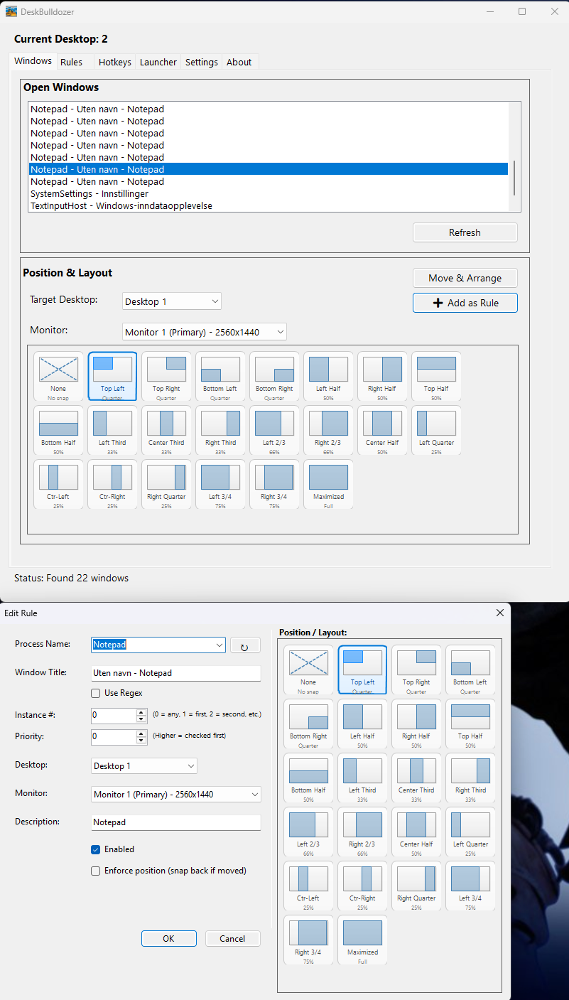
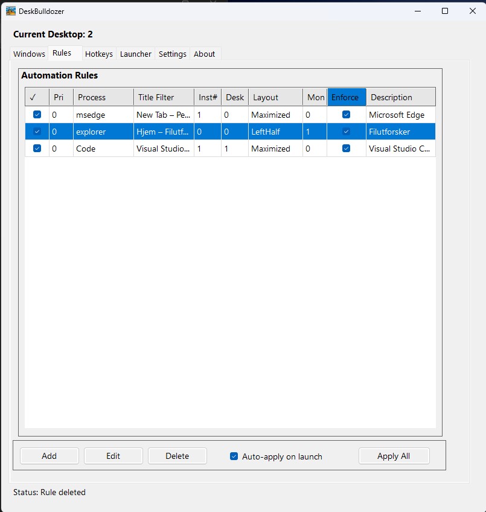
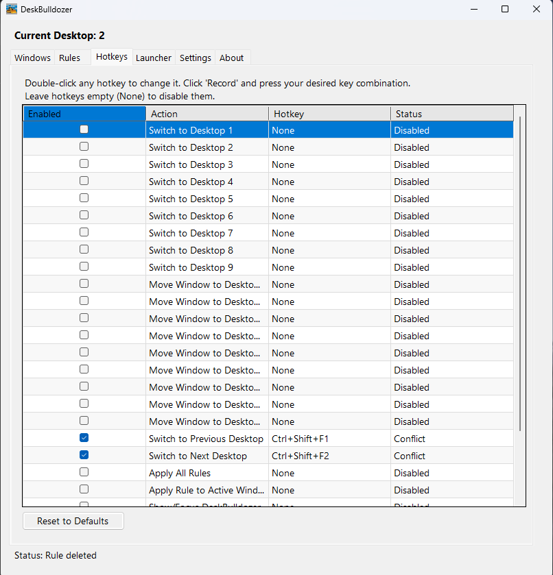
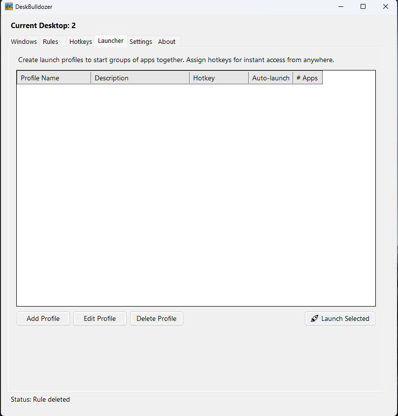
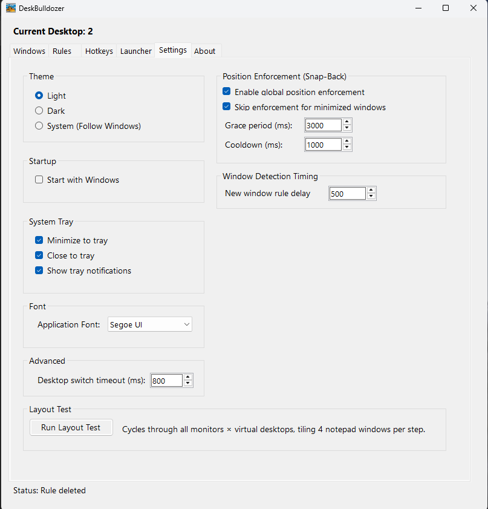

# DeskBulldozer

DeskBulldozer is a Windows desktop utility for keeping app windows organized across virtual desktops. It combines manual window controls with rules and hotkeys.
## What it does

- Move windows between virtual desktops
- Snap windows into common layouts on the selected monitor
- Create rules that auto-place matching windows
- Register global hotkeys for desktop and window actions
- Pin windows across all desktops
- Run quietly from the system tray

## Requirements

- Windows 11 recommended
- .NET 8 SDK/runtime
- `VirtualDesktopAccessor.dll` in `VDManager/Native/`

Download the native DLL from:
https://github.com/Ciantic/VirtualDesktopAccessor/releases

